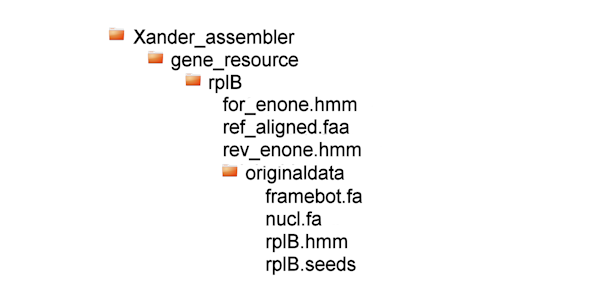

## Adding Gene Resources to Xander

The Xander analysis pipeline is preconfigured for the genes rplB, amoA_AOA, AmoA_AOB, nifH, nirK, nirS, norB_cNor, norB_qNor, nosZ, and nosZ_a2. It is possible, however, to add resource files for other genes by following the process given here.

First, go the the FunGene page (http://fungene.cme.msu.edu/) and see if your gene of interest has been already been entered. If not, you must select seed sequences covering the diversity of your gene. It requires some expertise to do this properly. Then contact the RDP staff (
http://rdp.cme.msu.edu/misc/contacts.jsp) and request that they add your seed sequences to FunGene. FunGene searches for related sequences and updates approximately monthly, so if your gene is not already listed it is important to submit seed sequences as soon as possible. 

Reference sequence files and models for each gene targeted for assembly are placed in a gene reference directory. This directory is usually inside the `Xander_assembler/gene_resource` directory, but may be elsewhere if necessary (e.g. in your home directory on a cluster).

### File organization
Under the `gene_resource` is a sub-directory is named for the gene; it contains several gene resource files and the subdirectory `originaldata` in this configuration:



In this example, the gene directory is `rplB`. It contains three files and the sub-directory `originaldata` which in turn contains the four files required for preparing HMMs and for post-assembly processing. These four files are:

- `rplB.seeds`: a small set of protein sequences in FASTA format, used to build forward and reverse HMMs for the gene. These seeds can be downloaded from FunGene.
- `rplB.hmm`: the HMM built from rplB.seeds using **HMMER3.0** and can also be downloaded from FunGene.
- `framebot.fa`: a large near full length known protein set for identifying starting kmers and for FrameBot nearest matching.
- `nucl.fa`: a large near full length known set used by **UCHIME** for chimera checking.

For a new gene, all four of these files can be downloaded from the FunGene page at http://fungene.cme.msu.edu/index.spr. 

## Downloading Files from FunGene

- Go to the FunGene page and click on your gene of interest.
- Download  the `gene.seeds` and `gene.hmm` files using the links in the upper left of the FunGene gene page.
- Click on "Display Options" in the upper right of the page.
- Change Sequences per page to 2000.
- Change Show Isolates/Environmental/Both to Isolate.
- Click on Update. This applies your changes and takes you back to the FunGene gene page.
- Click on Show/Hide filter options in the upper right of the page.
- Set Minimum HMM coverage to 80. More diversity is better. More sequences mean more starting points, requiring more computational time, but make the process of model creation less susceptible to noise. Click on Filter.
- Browse the results. You may find that definitions for some lower scoring sequences do not match your gene of interest. If so, you may further filter the display by entering a Minimum score under Show/Hide filter options and clicking on Filter again.
-  Once satisfied with your filtering options, you can download the sequences. Beginning on page 1 (link in upper left), click on Select Entire Page in the upper left of the page. Assuming you are displaying 2,000 sequences per page, you may do this for up to 5 pages at a time. You may not download more than 10,000 sequences at a time.
- Next download the sequences by clicking on Begin analysis in the upper left of the page.
- Set Download with labels to accno.
- Set Download format to fasta.
- Uncheck the Aligned box.
- Select Protein download and click the Download button. Save the file.
- Select Nucleotide Download and click the Download button. Save the tile.
- If you had more than 10,000 sequences or 5 pages to download, return to your last page by selecting the appropriate page/tab in your browser. Click on Deselect All Sequences, click on the next page number, select all sequences, etc. and download the rest of the unalighned protein and nucleotide sequences. 
- Put all of the files you downloaded in the original data file for your new gene.

### Dereplicate and Filter Sequences

Some further filtering of the downloaded sequences is required. FunGene collects duplicate sequences which should be removed by dereplication. Despite selecting isolates only, sometimes sequences for uncultured microorganisms are still present in the downloaded sequences and should be removed. Also, it is desirable to remove sequences with less than 50% identitiy to the closest seed sequence. The following code performs the necessary filtering after first catenating your downloaded files together if necessary. The python scripts are at * in the folder *. Edit the path to the python scripts and RDPTools as necessary.

```
#!/bin/bash

# If FunGene sequences are in parts, catenate the parts together.
echo "Catenating parts."
cat *_unaligned_protein_seqs.fa > protein.faa 
cat *_unaligned_nucleotide_seqs.fa > nucleotide.fna

# Remove any uncultured sequences from funGene protein sequences.
echo "Removing sequences from uncultured microorganisms."
python ~/scripts/filter_uncultured_seqs.py protein.faa uncult_protein.fa

# Remove duplicates:
echo "Removing duplicate protein sequences."
java -Xmx2g -jar /usr/local/RDPTools/ReadSeq.jar rm-dupseq -d -i protein.faa  -o derep.fa
echo "Removing duplicate nucleotide sequences."
java -Xmx2g -jar /usr/local/RDPTools/ReadSeq.jar rm-dupseq -d -i nucleotide.fna  -o nucl.fa

# Determine the proportional identity for each remaining sequence 
# using the pairwise-knn sub-command to Alignment.jar:
echo "Determining identity to seed sequences."
java -Xmx2g -jar /usr/local/RDPTools/AlignmentTools.jar pairwise-knn  -o knn_result.txt  derep.fa *.seeds

# Filter out all sequences with proportional identity less than 0.5.
echo "Removing sequences if identitiy to closest seed is less than 0.5."
python ~/scripts/filter_knn_result.py knn_result.txt framebot.fa

```
You are now ready to prepare the gene reference files.

### Prepare Gene Reference Files

The script `prepare_gene_ref.sh`, present in `/RDPTools/Xander_assembler/bin/`builds HMMs for Xander and aligns the  reference sequences. The script does this using  hmmer-3.0_xanderpatch, a modified version of HMMMER3.0 (see Installing RDPTools). The modified version is tuned to detect close orthologs. 
* __Inputs__ include three files from the `originaldata` directory:
    * `gene.seeds`
    * `gene.hmm`
    * `framebot.fa` 

    where `gene` is the name of the gene.
* __Outputs__ are saved to the `gene` directory within `gene_resource`
    * `for_enone.hmm`: forward HMM for assembling gene contigs
    * `rev_enone.hmm`: reverse HMM for assembling gene contigs
    * `ref_aligned.faa`: contains the framebot.fa sequences aligned with for_enone.hmm and is used by Xander to identify starting kmers.

Copy `prepare_gene_ref.sh` from the `Xander_assembler/bin` directory to your scripts directory, for example to `~/scripts`. Open the file in a text editor and edit the JAR\_DIR, REF\_DIR and hmmer\_xanderpatch assignments to match your installation. **The REF\__DIR is the path to the gene\_resource directory, not the sub-directory named for your gene.** It does not have to be under `Xande_assembler` but should be for a local RDPTools installation.

Run the script. It takes a single argument, the gene name.  Remember, if you change the location of the gene resource directory to build files for a different gene, you will have to edit this script again accordingly.

```
~/scripts/prepare_gene_ref.sh new_gene_name
```

 It is important to manually examine the alignment of ref\_aligned.faa using Jalview or  another alignment viewing tool to spot any badly aligned sequences. If found, it is likely that there are no sequences in gene.seeds close these sequences. You need to determine if these problem sequences are actually from your gene of interest, and then either remove them or add some representative sequences to gene.seeds and repeat the preparation steps (including building gene.hmm with **HMMER3.0**). In some cases it will not be possible to get good alignments of ref_aligned.faa without dividing  the seed sequences and framebot.fa into subsets. And of course, in such cases, the gene.hmm and other gene reference files need to be built for each subset of the seeds.

### Test gene references

Check the file permissions for the files in the gene resource directory to be sure they are all readable by user, group, and world. If not, make them so (`chmod 644 filename`). Then test that your new gene resource files work by running Xander with a subset of `framebot.fa` as the sample sequences (`SEQFILE`). See *Test Local Xander Installation* or *Interactive Xander on MSU's HPCC*.

*insert troubleshooting ideas if xander does not successfully assemble gene resource sequences*

### Add Taxonomy to framebot.fa

Once assured that your new gene resource files work, you can add taxonomy to the `framebot.fa` file. If taxonomy is added, Xander will automatically calculate the relative abundance of each phylum. 

* Requirements
    * python 2.7
    * Biopython 1.7.0
    * Internet connection. 
    
* (If necessary) Biopython can be installed with the following command:

    `sudo apt-get install python-biopython`
    
    or by following the instrucitons at https://pypi.python.org/pypi/biopython.

#### __Workflow__


* Create a directory and copy `framebot.fa` to it. For example, if you have been working on adding capability for the gene but, you might do the following:
    

```
mkdir ~/add\_taxonomy
cd ~/add\_taxonomy
cp /usr/local/RDPTools/Xander_assembler/gene_resource/but/originaldata/framebot.fa ~/add_taxonomy/
```

You may have to edit the path to framebot.fa depending on your FrameBot installation.

- Make a script `add_framebot_taxonomy.sh` with the following code:

```
#!/bin/bash

# Configure the path to the pythonscripts directory:
scripts_dir=/usr/local/RDPTools/Xander_assembler/pythonscripts

# Parse the accession numbers to the file accnos.txt:
cat framebot.fa | grep ">" |  sed 's/\(>\)\([A-Z 0-9]*\)\(.*\)/\2/' > accnos.txt

# For each accession number in accnos.txt, download the GenBank file in xml format:
python $scripts_dir/fetch_ncbi_xml.py protein accnos.txt ./temp xml

# Parse the phylogenies from the xml files and write them to the 
# framebot.fa sequence descriptions:
python $scripts_dir/parse_ncbi_lineage.py  framebot.fa  ./temp  ./temp/framebot.fa
```

   * Edit the script so that the path to the `pythonscripts` directory matches the path in your FrameBot installation.
   * Make sure the script is executable. If not, run `chmod 744 add_framebot_taxonomy.sh` to make it executable.
   * Change into the `add_taxonomy` directory.
   * Then, from the `add_taxonomy` directory, run `./add_framebot_taxonomy.sh`.

 ##### __Outputs:__

<UL>
    <UL>
<LI>Directory <CODE>temp</CODE> under your working directory (<CODE>~/add_taxonomy/temp</CODE>)
<LI><CODE>framebot.fa</CODE> with taxonomy in the temp directory
    </UL>
</UL>

* Replace the `framebot.fa` in the `gene_resource` directory with this modified version; then Xander will be able to include taxonomy in its output.
