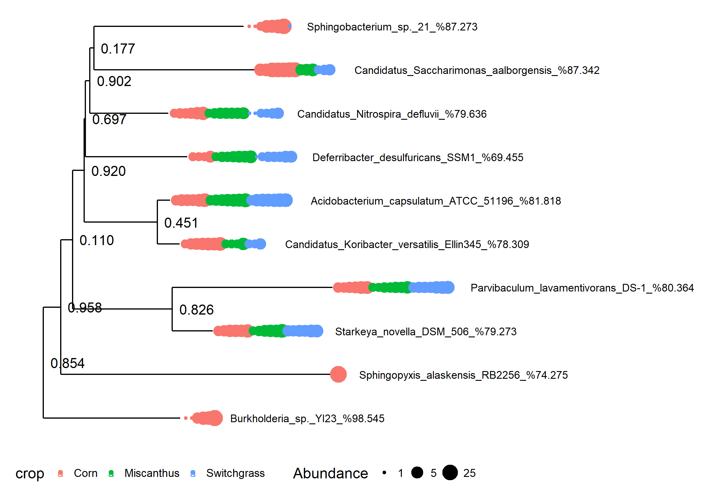

Xander to Phyloseq
============

This document explains how to fill an experiment-level `phyloseq` object with Xander output. This example is for rplB contigs found in the 21 KBS soil metagenomes used for the original Xander paper (Wang et al, 2015). The files necessary to create this experiment-level object were produced by the script `xander_cluster_sample.sh` listed below.

## xander_cluster_samples.sh

``` r
#!/bin/bash
# xander_cluster_samples.sh
# John Quensen
# March 2018

## Set path to RDPTools
RDPToolsDir=/mnt/research/rdp/public/RDPTools
## Load FastTree
module load FastTree

## Get working directory, experiment directory, distance, gene from command line.
## working directory is where results will be written.
## Experiment directory is directory containing Xander or MegaGTA results for all samples.
## Distance is clustering distance.
## Gene is gene being analyzed, e.g. rplB, nifH, etc.

while getopts "w:e:d:g:" option; do
    case ${option} in
        w) work_dir=${OPTARG};; # path to working (summary) directory
        e) expt_dir=${OPTARG};; # path the experiment directory
        d) distance=${OPTARG};; # cluster distance for otu table and corresponding representative sequences
        g) gene=${OPTARG};; # gene
    esac
done

if [[ -z $work_dir || -z $expt_dir || -z $distance || -z $gene ]]; then
   echo "Usage: -w <work_dir> -e <expt_dir> -d <distance> -g <gene>"
   exit 1
fi

## Get files.
cd $work_dir
# find $expt_dir/ -name "*"$gene"*coverage.txt" -exec cp {} $work_dir/ \;
# find $expt_dir/ -name "*"$gene"*final_prot_aligned.fasta" -exec cp {} $work_dir/ \;
mkdir taxa
find $expt_dir/ -name "*"$gene"*framebot.txt" -exec cp {} $work_dir/taxa/ \;
rm taxa/*failed*.txt

## Catenate coverage files.
cat *coverage.txt > sam_coverage.txt
#Dereplilcate
java -Xmx2g -jar $RDPToolsDir/Clustering.jar derep -o derep.fa -m '#=GC_RF' ids samples *.fasta
##Calculate distance matrix
java -Xmx2g -jar $RDPToolsDir/Clustering.jar dmatrix -c 0.5 -I derep.fa -i ids -l 50 -o dmatrix.bin
##Cluster. By default, the resulting clust file includes results for all 
## distances from 0 to 0.5 by 0.01.
java -Xmx2g -jar $RDPToolsDir/Clustering.jar cluster -d dmatrix.bin -i ids -s samples -o complete.clust

## Get representative sequences for specified distance.
mkdir alignment
mv *aligned.fasta alignment
java -Xmx2g -jar $RDPToolsDir/AlignmentTools.jar alignment-merger alignment  merged_aligned.fasta
java -Xmx2g -jar $RDPToolsDir/Clustering.jar rep-seqs -c -l -m "#=GC_RF" -I ids -s complete.clust $distance  merged_aligned.fasta
java -Xmx2g -jar $RDPToolsDir/Clustering.jar to-unaligned-fasta complete.clust_rep_seqs.fasta | cut -f1 -d ' ' > unaligned_rep_seqs.fasta
sed -i 's/cluster/OTU/' unaligned_rep_seqs.fasta

## Get coverage adjusted OTU matrix file for specified distance
java -Xmx2g -jar $RDPToolsDir/Clustering.jar cluster_to_Rformat complete.clust . $distance $distance sam_coverage.txt

## Match FrameBot matches to machine names of representative sequences.
cat taxa/*.txt > matches.txt
grep "STATS" matches.txt | cut -f2,3,4,5,6 | cut -d "_" -f 2- > match_taxa_machine_names.txt
## Match cluster numbers to machine names of representative sequences.
grep ">" complete.clust_rep_seqs.fasta | cut -f1 -d "," | sed 's/>//' | sed 's/seq_id=//' | sed 's/  /\t/'  >  match_cluster_machine_name.txt

## Make tree file
java -Xmx$16g -jar /mnt/research/rdp/public/RDPTools/Clustering.jar derep -f -o rep_seqs_model_only.fasta ids samples complete.clust_rep_seqs.fasta
FastTree rep_seqs_model_only.fasta > my_tree.nwk
```

## Load R Packages, Functions

`RDPutils` is available at https://github.com/jfq3/RDPutils. Version 1.4.1 or later is required.

``` r
suppressWarnings(suppressPackageStartupMessages(library("RDPutils")))

unpad_otu_names <- function(otu.table) {
  otu.names <- colnames(otu.table)
  for (i in 1:length(otu.names)) {
    otu.name.parts <- unlist(strsplit(otu.names[i], "_"))
    while (base::substr((otu.name.parts[2]), 1, 1)=="0") {
      otu.name.parts[2] <- base::substr(otu.name.parts[2], 2, Biostrings::nchar(otu.name.parts[2]))
    }
  otu.names[i] <- paste(otu.name.parts[1],otu.name.parts[2], sep = "_")
  }
  colnames(otu.table) <- otu.names
  return(otu.table)  
}

shorten_sample_names <- function(otu.table) {
  rn <- row.names(otu.table)
  rn <- base::substr(rn, 1, 2)
  rownames(otu.table) <-  rn
  return(otu.table)
}

make_crop_vector <- function(otu.table) {
  crop <- substr(rownames(otu.table), 1, 1)
  for (i in  1:length(crop)) {
    if (crop[i] == "C") {
      crop[i] <- "Corn"
    } else {
      if (crop[i] == "S") {
        crop[i] <-  "Switchgrass"
      } else {
        crop[i] <- "Miscanthus"
      }
    }
  }
  return(crop)
}
```

## Make and Compare OTU Tables

This can be done in either of two ways: read in the R-formatted table, or parse the information from the cluster file.

``` r
otu.rformat <- read.table("xander_rplB_rformat_dist_0.05.txt", header = TRUE, row.names = 1, sep = "\t")
rownames(otu.rformat)[1:5]
```

    ## [1] "C5_rplB_45_final_prot_aligned" "S6_rplB_45_final_prot_aligned"
    ## [3] "C6_rplB_45_final_prot_aligned" "S5_rplB_45_final_prot_aligned"
    ## [5] "C1_rplB_45_final_prot_aligned"

The sample names in the R-formatted table are too long. They are the names of the aligned aa sequence files. The first two characters of these file names are the sample names. Use the function `shorten_sample_names` loaded above to shorten the row names (sample names) to just the first two characters.

``` r
otu.rformat <- shorten_sample_names(otu.rformat)
rownames(otu.rformat)
```

    ##  [1] "C5" "S6" "C6" "S5" "C1" "C2" "M3" "M7" "M1" "S3" "S1" "M4" "C4" "C3"
    ## [15] "M2" "S2" "M5" "S4" "S7" "C7" "M6"

``` r
colnames(otu.rformat)[1:6]
```

    ## [1] "OTU_00001" "OTU_00002" "OTU_00003" "OTU_00004" "OTU_00005" "OTU_00006"

Now the sample names are the way that we want them. The taxa names (OTUs) are padded with zeroes to all be the same length.

Inspect the OTU table.

``` r
dim(otu.rformat)
```

    ## [1]    21 17005

``` r
sum(otu.rformat)
```

    ## [1] 27456

``` r
table(colSums(otu.rformat)==0)
```

    ## 
    ## FALSE  TRUE 
    ##  9418  7587

There are a large number of empty OTUs. I will remove them later.

Compare an OTU table parsed from the cluster file.

``` r
otu.clstr <- clstr2otu("xander_rplB_complete.clust", dist = 0.05)
rownames(otu.clstr)
```

    ##  [1] "C1_rplB_45_final_prot_aligned" "C2_rplB_45_final_prot_aligned"
    ##  [3] "C3_rplB_45_final_prot_aligned" "C4_rplB_45_final_prot_aligned"
    ##  [5] "C5_rplB_45_final_prot_aligned" "C6_rplB_45_final_prot_aligned"
    ##  [7] "C7_rplB_45_final_prot_aligned" "M1_rplB_45_final_prot_aligned"
    ##  [9] "M2_rplB_45_final_prot_aligned" "M3_rplB_45_final_prot_aligned"
    ## [11] "M4_rplB_45_final_prot_aligned" "M5_rplB_45_final_prot_aligned"
    ## [13] "M6_rplB_45_final_prot_aligned" "M7_rplB_45_final_prot_aligned"
    ## [15] "S1_rplB_45_final_prot_aligned" "S2_rplB_45_final_prot_aligned"
    ## [17] "S3_rplB_45_final_prot_aligned" "S4_rplB_45_final_prot_aligned"
    ## [19] "S5_rplB_45_final_prot_aligned" "S6_rplB_45_final_prot_aligned"
    ## [21] "S7_rplB_45_final_prot_aligned"

``` r
colnames(otu.clstr)[1:10]
```

    ##  [1] "OTU_00001" "OTU_00002" "OTU_00003" "OTU_00004" "OTU_00005"
    ##  [6] "OTU_00006" "OTU_00007" "OTU_00008" "OTU_00009" "OTU_00010"

These sample names are too long, too. Like the R-formatter version of the OTU table, the taxa names begin with "OTU" and are padded with zeroes to the same length. The OTU table could have been parsed to give OTU names with the "biom" format instead.

``` r
otu.clstr.b <- clstr2otu("xander_rplB_complete.clust", dist = 0.05, otu_format = "biom")
rownames(otu.clstr.b)
```

    ##  [1] "C1_rplB_45_final_prot_aligned" "C2_rplB_45_final_prot_aligned"
    ##  [3] "C3_rplB_45_final_prot_aligned" "C4_rplB_45_final_prot_aligned"
    ##  [5] "C5_rplB_45_final_prot_aligned" "C6_rplB_45_final_prot_aligned"
    ##  [7] "C7_rplB_45_final_prot_aligned" "M1_rplB_45_final_prot_aligned"
    ##  [9] "M2_rplB_45_final_prot_aligned" "M3_rplB_45_final_prot_aligned"
    ## [11] "M4_rplB_45_final_prot_aligned" "M5_rplB_45_final_prot_aligned"
    ## [13] "M6_rplB_45_final_prot_aligned" "M7_rplB_45_final_prot_aligned"
    ## [15] "S1_rplB_45_final_prot_aligned" "S2_rplB_45_final_prot_aligned"
    ## [17] "S3_rplB_45_final_prot_aligned" "S4_rplB_45_final_prot_aligned"
    ## [19] "S5_rplB_45_final_prot_aligned" "S6_rplB_45_final_prot_aligned"
    ## [21] "S7_rplB_45_final_prot_aligned"

``` r
colnames(otu.clstr.b)[1:10]
```

    ##  [1] "cluster_1"     "cluster_10"    "cluster_100"   "cluster_1000" 
    ##  [5] "cluster_10000" "cluster_10001" "cluster_10002" "cluster_10003"
    ##  [9] "cluster_10004" "cluster_10005"

It also has sample names that need to be shortened. Shorten the sample names and examine other parameters.

``` r
otu.clstr.b <- shorten_sample_names(otu.clstr.b)
rownames(otu.clstr.b)
```

    ##  [1] "C1" "C2" "C3" "C4" "C5" "C6" "C7" "M1" "M2" "M3" "M4" "M5" "M6" "M7"
    ## [15] "S1" "S2" "S3" "S4" "S5" "S6" "S7"

``` r
dim(otu.clstr.b)
```

    ## [1]    21 17005

``` r
sum(otu.clstr.b)
```

    ## [1] 65428

``` r
table(colSums(otu.clstr.b)==0)
```

    ## 
    ## FALSE 
    ## 17005

This OTU table does not have any empty OTUs, and the total counts is higher than for `otu.rformat`. These counts have not been adjusted for coverage.

## Construct an Experiment Level phyloseq Object

Phyloseq objects have slots for an OTU table, sample data table, taxonomy table, reference sequences, and a tree file.

Here I use the coverage adjusted R-formatted OTU table output by the shell script above. I also create a simple sample data table including only crop type from the first letters of the sample names. In most cases, a more comprehensive sample data table with environmental data and perhaps other factors would be created in a spreadsheet program and imported.

### Sample Data Table
``` r
crop <- make_crop_vector(otu.rformat)
crop <- base::as.data.frame(crop)
rownames(crop) <- rownames(otu.rformat)
crop
```

    ##           crop
    ## C5        Corn
    ## S6 Switchgrass
    ## C6        Corn
    ## S5 Switchgrass
    ## C1        Corn
    ## C2        Corn
    ## M3  Miscanthus
    ## M7  Miscanthus
    ## M1  Miscanthus
    ## S3 Switchgrass
    ## S1 Switchgrass
    ## M4  Miscanthus
    ## C4        Corn
    ## C3        Corn
    ## M2  Miscanthus
    ## S2 Switchgrass
    ## M5  Miscanthus
    ## S4 Switchgrass
    ## S7 Switchgrass
    ## C7        Corn
    ## M6  Miscanthus

### Representative Sequences

Next, read in the representative sequences.

``` r
my_seqs <- readAAStringSet("xander_rplB_unaligned_rep_seqs.fasta", format = "fasta")
my_seqs
```

    ##   A AAStringSet instance of length 17005
    ##         width seq                                      names               
    ##     [1]   273 malkkykptspgrrfmsvs...kktrknkatdkfivrrrh OTU_1
    ##     [2]   275 mavkkckptsagrrqmats...trnnkrtnrfivtrrqkk OTU_2
    ##     [3]   273 malktynpttpgqrqlvmv...kktrknkatdkfivrrrh OTU_3
    ##     [4]   273 malkkfnpttpgqrqlvmv...kktrknkatdkfivrrrh OTU_4
    ##     [5]   273 malktfkptsaglrhvviv...kktrknkatdkfivrrrh OTU_5
    ##     ...   ... ...
    ## [17001]   164 kpersllkkqvskagrnnq...vrlpsgeqrlinvncmat OTU_16990
    ## [17002]   224 vrfrggghkkayrvvdfkr...ktrrnkstdkfivtrrkk OTU_16985
    ## [17003]   166 akierleydpnrsafiali...smnpvdhplgggegrssg OTU_16984
    ## [17004]   172 yiiapkglaqgdqviagkd...yktrknkrtnqfivrdrr OTU_16987
    ## [17005]   245 ekslvkgknrsggrnahgr...rtrkkrkpsdryivrgrr OTU_16986

Notice that these taxa names begin with "OTU_" but are not padded to the same length. We will have to make adjustments so that taxa names for the OTU table and reference sequences match.

### Taxonomy Table

Make a taxonomy table. This will consist of the closest matching reference sequences found by FrameBot.

``` r
my_taxa <- make_framebot_tax_table(clstr_machine = "match_cluster_machine_name.txt",
                                   taxa_machine = "match_taxa_machine_names.txt")
head(my_taxa)
```

    ## Taxonomy Table:     [6 taxa by 3 taxonomic ranks]:
    ##               genus                species             
    ## cluster_11072 "Desulfurobacterium" "thermolithotrophum"
    ## cluster_5411  "Microbacterium"     "laevaniformans"    
    ## cluster_16305 "Chelativorans"      "sp."               
    ## cluster_14764 "Phenylobacterium"   "zucineum"          
    ## cluster_4941  "Herbaspirillum"     "sp."               
    ## cluster_12255 "Erythrobacter"      "sp."               
    ##               strain                                                   
    ## cluster_11072 "Desulfurobacterium_thermolithotrophum_DSM_11699_%74.093"
    ## cluster_5411  "Microbacterium_laevaniformans_OR221_%89.781"            
    ## cluster_16305 "Chelativorans_sp._BNC1_%78.467"                         
    ## cluster_14764 "Phenylobacterium_zucineum_HLK1_%82.784"                 
    ## cluster_4941  "Herbaspirillum_sp._GW103_%82.051"                       
    ## cluster_12255 "Erythrobacter_sp._NAP1_%89.202"

Notice that `my_taxa` is already a `phyloseq` object. The taxa names are of the biom file format, not the R-formatter format. The ranks are genus, species, and strain. Strain is the name of the closest match found by FrameBot, and the genus and species are parsed from the strain name. I appended the percent identity to the reference sequence to the strain name. This should always be taken into account when interpreting results. Reference sequences for some OTUs may be quite distant from the closest match in the reference data base.

## Assemble Experiment Level Phyloseq Object

Before assembling an experiment-level phyloseq object, we need to make the taxa names consistent. I will do that here by making the taxa names begin with "OTU_" and "un-padding" them. The OTU table and sample data table (`crop`) also need to be converted to `phyloseq` objects.

### OTU Table

``` r
otu.rformat <- unpad_otu_names(otu.rformat)
my_otu <- otu_table(otu.rformat, taxa_are_rows = FALSE, errorIfNULL = TRUE)
my_otu[1:5, 1:5]
```

    ## OTU Table:          [5 taxa and 5 samples]
    ##                      taxa are columns
    ##    OTU_1 OTU_2 OTU_3 OTU_4 OTU_5
    ## C5     0     0     0     0     0
    ## S6     0     0     0     0     0
    ## C6     0     0     0     0     0
    ## S5     0     0     0     0     0
    ## C1     0     0     0     0     0

### Sample Data Table

``` r
my_sam <- sample_data(crop, errorIfNULL = TRUE)
my_sam
```

    ##           crop
    ## C5        Corn
    ## S6 Switchgrass
    ## C6        Corn
    ## S5 Switchgrass
    ## C1        Corn
    ## C2        Corn
    ## M3  Miscanthus
    ## M7  Miscanthus
    ## M1  Miscanthus
    ## S3 Switchgrass
    ## S1 Switchgrass
    ## M4  Miscanthus
    ## C4        Corn
    ## C3        Corn
    ## M2  Miscanthus
    ## S2 Switchgrass
    ## M5  Miscanthus
    ## S4 Switchgrass
    ## S7 Switchgrass
    ## C7        Corn
    ## M6  Miscanthus

### Taxonomy Table

``` r
taxa_names(my_taxa) <- base::sub("cluster", "OTU", taxa_names(my_taxa))
head(my_taxa)
```

    ## Taxonomy Table:     [6 taxa by 3 taxonomic ranks]:
    ##           genus                species             
    ## OTU_11072 "Desulfurobacterium" "thermolithotrophum"
    ## OTU_5411  "Microbacterium"     "laevaniformans"    
    ## OTU_16305 "Chelativorans"      "sp."               
    ## OTU_14764 "Phenylobacterium"   "zucineum"          
    ## OTU_4941  "Herbaspirillum"     "sp."               
    ## OTU_12255 "Erythrobacter"      "sp."               
    ##           strain                                                   
    ## OTU_11072 "Desulfurobacterium_thermolithotrophum_DSM_11699_%74.093"
    ## OTU_5411  "Microbacterium_laevaniformans_OR221_%89.781"            
    ## OTU_16305 "Chelativorans_sp._BNC1_%78.467"                         
    ## OTU_14764 "Phenylobacterium_zucineum_HLK1_%82.784"                 
    ## OTU_4941  "Herbaspirillum_sp._GW103_%82.051"                       
    ## OTU_12255 "Erythrobacter_sp._NAP1_%89.202"

### Assemble

``` r
expt <- phyloseq(my_otu, my_sam, my_seqs, my_taxa)
expt
```

    ## phyloseq-class experiment-level object
    ## otu_table()   OTU Table:         [ 17005 taxa and 21 samples ]
    ## sample_data() Sample Data:       [ 21 samples by 1 sample variables ]
    ## tax_table()   Taxonomy Table:    [ 17005 taxa by 3 taxonomic ranks ]
    ## refseq()      AAStringSet:      [ 17005 reference sequences ]

### Add Tree File

If you made a tree of the aligned representative sequences, you can add it, too. The tip labels need to be changed to the same format as taxa names in the other components - i.e. begin with "OTU_" and be unpadded.

``` r
my_tree <- read_tree("my_tree_file.nwk")
my_tree$tip.label <- base::sub("cluster", "OTU", my_tree$tip.label)
expt <- merge_phyloseq(expt, my_tree)
expt
```

    ## phyloseq-class experiment-level object
    ## otu_table()   OTU Table:         [ 17005 taxa and 21 samples ]
    ## sample_data() Sample Data:       [ 21 samples by 1 sample variables ]
    ## tax_table()   Taxonomy Table:    [ 17005 taxa by 3 taxonomic ranks ]
    ## phy_tree()    Phylogenetic Tree: [ 17005 tips and 17003 internal nodes ]
    ## refseq()      AAStringSet:      [ 17005 reference sequences ]

### Remove Empty OTUs

There are 17005 OTUs in `expt`. We know some of these are empty. We can easily remove the empty taxa:

``` r
expt <- prune_taxa(taxa_sums(expt)>0, expt)
expt
```

    ## phyloseq-class experiment-level object
    ## otu_table()   OTU Table:         [ 9418 taxa and 21 samples ]
    ## sample_data() Sample Data:       [ 21 samples by 1 sample variables ]
    ## tax_table()   Taxonomy Table:    [ 9418 taxa by 3 taxonomic ranks ]
    ## phy_tree()    Phylogenetic Tree: [ 9418 tips and 9416 internal nodes ]
    ## refseq()      AAStringSet:      [ 9418 reference sequences ]

## Sample Analyses

Once we have an experiment level `phyloseq` object assembled, we can explore and analyze our data, not only using `phyloseq`'s wrappers, but any other R packages and our own R functons. Below I make use of two R packages I have written. They are available at https://github.com/jfq3. 

### Ordination

The ordination presented the original Xander paper (Wang et al., 2015) was a PCA calculated from the square root of Wisconsin standardized counts that had been adjusted for coverage.This ordination is replicated here, but with `ggplot` graphics.

``` r
suppressWarnings(suppressPackageStartupMessages(library("QsRutils")))
suppressPackageStartupMessages(library("ggordiplots"))

otu <- veganotu(expt)
crop <- vegansam(expt)
otu.std <- sqrt(wisconsin(otu))
pca <- rda(otu.std)
axis.labels <- pca_labels(pca)[1:2]
plt <- gg_ordiplot(pca, groups = crop[ , 1], plot = FALSE)
plt$plot +
  xlab(axis.labels[1]) +
  ylab(axis.labels[2]) +
  guides(color=guide_legend("Crop")) +
  ggtitle("PCA for rplB in KBS Soil", subtitle = " Square Root of Wisconsin Transformed Counts")
```


### Make a Tree Plot

Plot a tree for the ten most abundant OTUs. Label the tips with the strain of the closest match.

``` r
expt.10 <- prune_taxa(names(sort(taxa_sums(expt), TRUE)[1:10]), expt)
tree.plot.1 <- plot_tree(expt.10, color="crop", size="abundance",
                    label.tips="strain", text.size=3, ladderize="left")
tree.plot.1 <- tree.plot.1 + theme(legend.position = "bottom",
                       legend.title = element_text(size=12),
                       legend.key = element_blank())
tree.plot.1
```



Two of these OTUs are found only in corn, and one is found almost exclusively in corn. Corn is well separated from the other crops in the ordination.

## Reference
Wang, Q., Fish, J. A., Gilman, M., Sun, Y., Brown, C. T., Tiedje, J. M., & Cole, J. R. (2015). Xander: Employing a Novel Method for Efficient Gene-Targeted Metagenomic Assembly. Microbiome, 3(1). Retrieved from http://www.microbiomejournal.com/content/3/1/32 doi:10.1186/s40168-015-0093-6