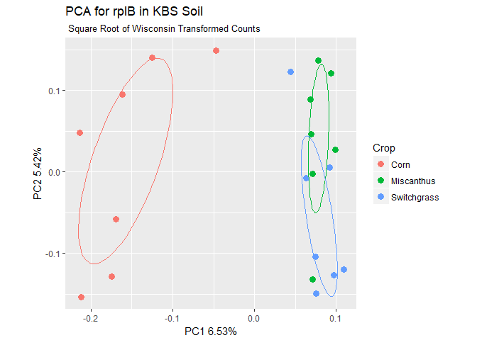
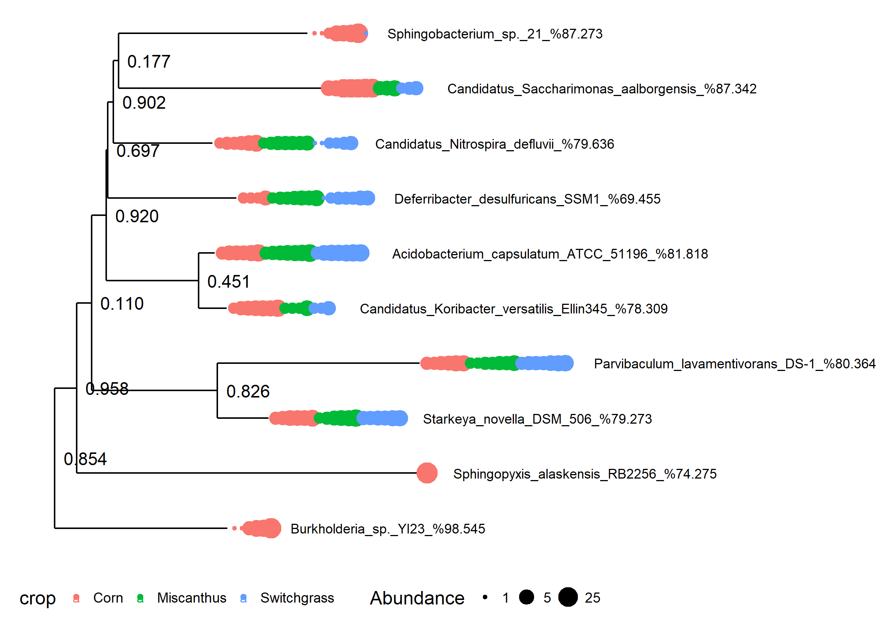

## Xander Results for Multiple Samples

Xander is run on one sample at a time. To perform any type of community analysis with your assembled contigs, results from all samples must be gathered together and  reduced to an OTU table. The script `get_OTUabundance.sh` in `RDPTools/Xander_assembler/bin/` is provided to create coverage-adjusted OTU abundance data matrices from contigs of the same gene from multiple samples. Inputs and outputs for this script are:

* __Inputs__
	* `final_prot_aligned.fasta` files for _all_ samples of interest
	* A file of *all* the sample coverage files concatenated together
	
* __Outputs__
	* `rformat_dist_0.##.txt`: data matrix files with OTU abundances for each sample at given distances (0 to 0.5 by 0.01 steps by default). The data matrices can then imported into R for more extensive analysis and visualization functions. Currently values in the OTU matrix are rounded to include whole number OTU abundances (counts).

The modified script introduced below, `xander_cluster_samples.sh`, goes several steps further, providing files that may be used to populate an experiment-level `phyloseq` object with, in additon to the OTU table, representative sequences for each OTU, a tree of the representative sequences, and a taxonomy table giving the genus, species, and strain of the closest match to each OTU. A corresponding sample data table is usually created separately in a spreadhseet program and then added to the `phyloseq` object. 

### Planning ahead

It is easier to collect the necessary files together if you plan ahead. And indeed, `xander_cluster_samples.sh` "assumes" that you do the following:

* Before running Xander, create a directory for your experiment. Within it, create a Xander output directory for each sample in your experiment. 
* When you run Xander, in the `xander_setenv.sh` file for each sample give a `SAMPLE_SHORTNAME` that identifies the sample and point the output to the appropriate sample directory. If you are using MSU's HPCC, you can submit multiple jobs (up to 250, but good luck with that) at the same time. 

### xander_cluster_samples.sh

The script `xander_cluster_samples.sh` is  listed here for your reference. The script is written to run on MSU's HPCC. To run elsewhere you probably need to comment out the line `module load FastTree` and set FastTree to the full path and program name appropriate to your installaton. You would also need to set RDPToolsDir to the full path for your installation of RDPTools. The script is run by entering a command of the form:

```
/path_to_script/xander_cluster_samples.sh -w work_dir -e expt_dir -d distance -g gene
```
where:
- work_dir is a pre-existing directory to which results will be written
- expt_dir is the experiment directory contianing all Xander sample directories for the experiment
- distance is the one distance for which the OTU table will be created, e.g. 0.05
- gene is the gene being analyzed

The script:

``` r
#!/bin/bash
# xander_cluster_samples.sh
# John Quensen
# March 2018

## Configuration section
## Set path to RDPTools
RDPToolsDir=/mnt/research/rdp/public/RDPTools
## Load FastTree. If on MSU's HPCC, then
module load FastTree
## Else, comment out the line above and set FastTree to the full path plus program name:
# FastTree=full_path/fasttree

## Get working directory, experiment directory, distance, gene from command line.
## working directory is where results will be written.
## Experiment directory is directory containing Xander or MegaGTA results for all samples.
## Distance is clustering distance.
## Gene is gene being analyzed, e.g. rplB, nifH, etc.

while getopts "w:e:d:g:" option; do
    case ${option} in
        w) work_dir=${OPTARG};; # path to working (summary) directory
        e) expt_dir=${OPTARG};; # path the experiment directory
        d) distance=${OPTARG};; # cluster distance for otu table and corresponding representative sequences
        g) gene=${OPTARG};; # gene
    esac
done

if [[ -z $work_dir || -z $expt_dir || -z $distance || -z $gene ]]; then
   echo "Usage: -w <work_dir> -e <expt_dir> -d <distance> -g <gene>"
   exit 1
fi

## Get files.
cd $work_dir
find $expt_dir/ -name "*"$gene"*coverage.txt" -exec cp {} $work_dir/ \;
find $expt_dir/ -name "*"$gene"*final_prot_aligned.fasta" -exec cp {} $work_dir/ \;
mkdir taxa
find $expt_dir/ -name "*"$gene"*framebot.txt" -exec cp {} $work_dir/taxa/ \;
rm taxa/*failed*.txt

## Catenate coverage files.
cat *coverage.txt > sam_coverage.txt

## Dereplilcate
java -Xmx2g -jar $RDPToolsDir/Clustering.jar derep -o derep.fa -m '#=GC_RF' ids samples *.fasta

## Calculate distance matrix
java -Xmx2g -jar $RDPToolsDir/Clustering.jar dmatrix -c 0.5 -I derep.fa -i ids -l 50 -o dmatrix.bin

## Cluster. By default, the resulting clust file includes results for all 
## distances from 0 to 0.5 by 0.01.
java -Xmx2g -jar $RDPToolsDir/Clustering.jar cluster -d dmatrix.bin -i ids -s samples -o complete.clust

## Get representative sequences for specified distance.
mkdir alignment
mv *aligned.fasta alignment
java -Xmx2g -jar $RDPToolsDir/AlignmentTools.jar alignment-merger alignment  merged_aligned.fasta
java -Xmx2g -jar $RDPToolsDir/Clustering.jar rep-seqs -c -l -m "#=GC_RF" -I ids -s complete.clust $distance  merged_aligned.fasta
java -Xmx2g -jar $RDPToolsDir/Clustering.jar to-unaligned-fasta complete.clust_rep_seqs.fasta | cut -f1 -d ' ' > unaligned_rep_seqs.fasta
sed -i 's/cluster/OTU/' unaligned_rep_seqs.fasta

## Get coverage adjusted OTU matrix file for specified distance
java -Xmx2g -jar $RDPToolsDir/Clustering.jar cluster_to_Rformat complete.clust . $distance $distance sam_coverage.txt

## Match FrameBot matches to machine names of representative sequences.
cat taxa/*.txt > matches.txt
grep "STATS" matches.txt | cut -f2,3,4,5,6 | cut -d "_" -f 2- > match_taxa_machine_names.txt

## Match cluster numbers to machine names of representative sequences.
grep ">" complete.clust_rep_seqs.fasta | cut -f1 -d "," | sed 's/>//' | sed 's/seq_id=//' | sed 's/  /\t/'  >  match_cluster_machine_name.txt

## Make tree file
java -Xmx16g -jar /mnt/research/rdp/public/RDPTools/Clustering.jar derep -f -o rep_seqs_model_only.fasta ids samples complete.clust_rep_seqs.fasta
FastTree rep_seqs_model_only.fasta > my_tree.nwk
```
## Assemble a phyloseq Object

The example below describes how an experiment-level `phyloseq` object for the gene rplB was created from the results for the 21 metagenome samples referenced in the original Xander paper (Wang *et.al.*, 2015). The R script depends on `phyloseq` and `RDPutils` version 1.4.1 or above. Instructions for installing `phyloseq` are given at https://bioconductor.org/packages/release/bioc/html/phyloseq.html. Instructions for installing `RDPutils` from GitHub are given at https://john-quensen.com/github/.

### Initial steps
1. Create an R working directory.
2. Put the following files, created by the script `xander_cluster_samples.sh`, in the R working directory:
    - xander_rplbB_rformat_dist_0.05.txt
    - xander_rplB_unaligned_rep_seqs.fasta
    - match_taxa_machine_names.txt
    - match_cluster_machine_name.txt
    - my_tree.nwk     


### R Script

Open R in a terminal or in RStudio and set the path to the working directory. Then run the R commands below. They are given in sections so that each step may be explained. R ouput lines begin with ##.

#### Load packages and functions.

Loading `RDPutils` will automatically load its dependencies including `phyloseq`.

    suppressWarnings(suppressPackageStartupMessages(library("RDPutils")))

    unpad_otu_names <- function(otu.table) {
      otu.names <- colnames(otu.table)
      for (i in 1:length(otu.names)) {
        otu.name.parts <- unlist(strsplit(otu.names[i], "_"))
        while (base::substr((otu.name.parts[2]), 1, 1)=="0") {
          otu.name.parts[2] <- base::substr(otu.name.parts[2], 2, Biostrings::nchar(otu.name.parts[2]))
        }
      otu.names[i] <- paste(otu.name.parts[1],otu.name.parts[2], sep = "_")
      }
      colnames(otu.table) <- otu.names
      return(otu.table)  
    }

    shorten_sample_names <- function(otu.table) {
      rn <- row.names(otu.table)
      rn <- base::substr(rn, 1, 2)
      rownames(otu.table) <-  rn
      return(otu.table)
    }

    make_crop_vector <- function(otu.table) {
      crop <- substr(rownames(otu.table), 1, 1)
      for (i in  1:length(crop)) {
        if (crop[i] == "C") {
          crop[i] <- "Corn"
        } else {
          if (crop[i] == "S") {
            crop[i] <-  "Switchgrass"
          } else {
            crop[i] <- "Miscanthus"
          }
        }
      }
      return(crop)
    }

#### Make OTU Table

The first step in creating the OTU table is to read in the R-formatted text file.

    otu.rformat <- read.table("xander_rplB_rformat_dist_0.05.txt", header = TRUE, row.names = 1, sep = "\t")
    rownames(otu.rformat)[1:5]

    ## [1] "C5_rplB_45_final_prot_aligned" "S6_rplB_45_final_prot_aligned"
    ## [3] "C6_rplB_45_final_prot_aligned" "S5_rplB_45_final_prot_aligned"
    ## [5] "C1_rplB_45_final_prot_aligned"

The sample names in the R-formatted table are too long. They are the names of the aligned aa sequence files. The first two characters of these file names are the sample names. Use the function `shorten_sample_names` loaded above to shorten the row names (sample names) to just the first two characters. You may have to edit `shorten_sample_names` to properly extract your sample names.


    otu.rformat <- shorten_sample_names(otu.rformat)
    rownames(otu.rformat)

    ##  [1] "C5" "S6" "C6" "S5" "C1" "C2" "M3" "M7" "M1" "S3" "S1" "M4" "C4" "C3"
    ## [15] "M2" "S2" "M5" "S4" "S7" "C7" "M6"

    colnames(otu.rformat)[1:6]

    ## [1] "OTU_00001" "OTU_00002" "OTU_00003" "OTU_00004" "OTU_00005" "OTU_00006"

Now the sample names are the way that we want them. The taxa names (OTUs) begin with OTU_ and are padded with zeroes to be all the same length.

Inspect the OTU table.

    dim(otu.rformat)

    ## [1]    21 17005

    sum(otu.rformat)

    ## [1] 27456

    table(colSums(otu.rformat)==0)

    ## 
    ## FALSE  TRUE 
    ##  9418  7587

There are a large number of empty OTUs because some coverage adjusted counts were less than 0.5. They will be removed later.

#### Make a sample data table

For this example a simple sample data table including only crop type will be created from the first letter of each sample name. In most cases, a more comprehensive sample data table with environmental data and treatment factors would be created in a spreadsheet program and imported.

    crop <- make_crop_vector(otu.rformat)
    crop <- base::as.data.frame(crop)
    rownames(crop) <- rownames(otu.rformat)
    crop

    ##           crop
    ## C5        Corn
    ## S6 Switchgrass
    ## C6        Corn
    ## S5 Switchgrass
    ## C1        Corn
    ## C2        Corn
    ## M3  Miscanthus
    ## M7  Miscanthus
    ## M1  Miscanthus
    ## S3 Switchgrass
    ## S1 Switchgrass
    ## M4  Miscanthus
    ## C4        Corn
    ## C3        Corn
    ## M2  Miscanthus
    ## S2 Switchgrass
    ## M5  Miscanthus
    ## S4 Switchgrass
    ## S7 Switchgrass
    ## C7        Corn
    ## M6  Miscanthus

#### Read in representative sequences

    my_seqs <- readAAStringSet("xander_rplB_unaligned_rep_seqs.fasta", format = "fasta")
    my_seqs

    ##   A AAStringSet instance of length 17005
    ##         width seq                                      names               
    ##     [1]   273 malkkykptspgrrfmsvs...kktrknkatdkfivrrrh OTU_1
    ##     [2]   275 mavkkckptsagrrqmats...trnnkrtnrfivtrrqkk OTU_2
    ##     [3]   273 malktynpttpgqrqlvmv...kktrknkatdkfivrrrh OTU_3
    ##     [4]   273 malkkfnpttpgqrqlvmv...kktrknkatdkfivrrrh OTU_4
    ##     [5]   273 malktfkptsaglrhvviv...kktrknkatdkfivrrrh OTU_5
    ##     ...   ... ...
    ## [17001]   164 kpersllkkqvskagrnnq...vrlpsgeqrlinvncmat OTU_16990
    ## [17002]   224 vrfrggghkkayrvvdfkr...ktrrnkstdkfivtrrkk OTU_16985
    ## [17003]   166 akierleydpnrsafiali...smnpvdhplgggegrssg OTU_16984
    ## [17004]   172 yiiapkglaqgdqviagkd...yktrknkrtnqfivrdrr OTU_16987
    ## [17005]   245 ekslvkgknrsggrnahgr...rtrkkrkpsdryivrgrr OTU_16986

Notice that these taxa names begin with "OTU_" but are not padded to the same length. We will have to make adjustments so that taxa names for the OTU table and reference sequences match.

#### Make a taxonomy table

This will consist of the closest matching reference sequences found by FrameBot.

    my_taxa <- make_framebot_tax_table(clstr_machine = "match_cluster_machine_name.txt",
                                       taxa_machine = "match_taxa_machine_names.txt")
    head(my_taxa)

    ## Taxonomy Table:     [6 taxa by 3 taxonomic ranks]:
    ##               Genus                Species             
    ## cluster_11072 "Desulfurobacterium" "thermolithotrophum"
    ## cluster_5411  "Microbacterium"     "laevaniformans"    
    ## cluster_16305 "Chelativorans"      "sp."               
    ## cluster_14764 "Phenylobacterium"   "zucineum"          
    ## cluster_4941  "Herbaspirillum"     "sp."               
    ## cluster_12255 "Erythrobacter"      "sp."               
    ##               Strain                                                   
    ## cluster_11072 "Desulfurobacterium_thermolithotrophum_DSM_11699_%74.093"
    ## cluster_5411  "Microbacterium_laevaniformans_OR221_%89.781"            
    ## cluster_16305 "Chelativorans_sp._BNC1_%78.467"                         
    ## cluster_14764 "Phenylobacterium_zucineum_HLK1_%82.784"                 
    ## cluster_4941  "Herbaspirillum_sp._GW103_%82.051"                       
    ## cluster_12255 "Erythrobacter_sp._NAP1_%89.202"

Notice that `my_taxa` is already a `phyloseq` object. The taxa names are of the biom file format, not the R-formatter format. The ranks are Genus, Species, and Strain. Strain is the name of the closest match found by FrameBot, and the genus and species are parsed from the strain name. The percent identity to the reference sequence is appended to the strain name. This should always be taken into account when interpreting results. The closest match can be quite distant from the reference sequence.

#### Read in the tree file

If you made a tree of the aligned representative sequences, you can add it, too. The tip labels will need to be changed to the same format as taxa names in the other components - i.e. begin with "OTU_" and be unpadded.

    my_tree <- read_tree("my_tree_file.nwk")
    my_tree$tip.label[1:5]

    ## [1] "cluster_417"  "cluster_8078" "cluster_5939" "cluster_1265"
    ## [5] "cluster_7284"

#### Make taxa names consistent

Before assembling an experiment-level `phyloseq` object, we need to make the taxa names consistent. I will do that here by making the taxa names begin with "OTU_" and "un-padding" them. The OTU table and sample data table (`crop`) also need to be converted to `phyloseq` objects.

    # Reformat OTU names in the OTU table & convert to phyloseq object:
    otu.rformat <- unpad_otu_names(otu.rformat)
    my_otu <- otu_table(otu.rformat, taxa_are_rows = FALSE, errorIfNULL = TRUE)
    my_otu[1:5, 1:5]

    ## OTU Table:          [5 taxa and 5 samples]
    ##                      taxa are columns
    ##    OTU_1 OTU_2 OTU_3 OTU_4 OTU_5
    ## C5     0     0     0     0     0
    ## S6     0     0     0     0     0
    ## C6     0     0     0     0     0
    ## S5     0     0     0     0     0
    ## C1     0     0     0     0     0

    # Reformat the OTU names in the taxonomy table & convert to phyloseq object:
    taxa_names(my_taxa) <- base::sub("cluster", "OTU", taxa_names(my_taxa))
    head(my_taxa)

    ## Taxonomy Table:     [6 taxa by 3 taxonomic ranks]:
    ##           Genus                Species             
    ## OTU_11072 "Desulfurobacterium" "thermolithotrophum"
    ## OTU_5411  "Microbacterium"     "laevaniformans"    
    ## OTU_16305 "Chelativorans"      "sp."               
    ## OTU_14764 "Phenylobacterium"   "zucineum"          
    ## OTU_4941  "Herbaspirillum"     "sp."               
    ## OTU_12255 "Erythrobacter"      "sp."               
    ##           Strain                                                   
    ## OTU_11072 "Desulfurobacterium_thermolithotrophum_DSM_11699_%74.093"
    ## OTU_5411  "Microbacterium_laevaniformans_OR221_%89.781"            
    ## OTU_16305 "Chelativorans_sp._BNC1_%78.467"                         
    ## OTU_14764 "Phenylobacterium_zucineum_HLK1_%82.784"                 
    ## OTU_4941  "Herbaspirillum_sp._GW103_%82.051"                       
    ## OTU_12255 "Erythrobacter_sp._NAP1_%89.202"

    # Reformat tree tip lables:
    my_tree$tip.label <- base::sub("cluster", "OTU", my_tree$tip.label)

    # Convert the sample_data table to a phyloseq object
    my_sam <- sample_data(crop, errorIfNULL = TRUE)
    my_sam

    ##           crop
    ## C5        Corn
    ## S6 Switchgrass
    ## C6        Corn
    ## S5 Switchgrass
    ## C1        Corn
    ## C2        Corn
    ## M3  Miscanthus
    ## M7  Miscanthus
    ## M1  Miscanthus
    ## S3 Switchgrass
    ## S1 Switchgrass
    ## M4  Miscanthus
    ## C4        Corn
    ## C3        Corn
    ## M2  Miscanthus
    ## S2 Switchgrass
    ## M5  Miscanthus
    ## S4 Switchgrass
    ## S7 Switchgrass
    ## C7        Corn
    ## M6  Miscanthus

#### Assemble experiment-level phyloseq object

Finally, assemble the components into an experiment-level `phyloseq` object.

    expt <- phyloseq(my_otu, my_sam, my_seqs, my_taxa, my_tree)
    expt

    ## phyloseq-class experiment-level object
    ## otu_table()   OTU Table:         [ 17005 taxa and 21 samples ]
    ## sample_data() Sample Data:       [ 21 samples by 1 sample variables ]
    ## tax_table()   Taxonomy Table:    [ 17005 taxa by 3 taxonomic ranks ]
    ## phy_tree()    Phylogenetic Tree: [ 17005 tips and 17003 internal nodes ]
    ## refseq()      AAStringSet:      [ 17005 reference sequences ]

We noted above that some OTUs are empty. We can easily remove the empty taxa with `phyloseq`'s `prune_taxa` function:

    expt <- prune_taxa(taxa_sums(expt)>0, expt)
    expt

    ## phyloseq-class experiment-level object
    ## otu_table()   OTU Table:         [ 9418 taxa and 21 samples ]
    ## sample_data() Sample Data:       [ 21 samples by 1 sample variables ]
    ## tax_table()   Taxonomy Table:    [ 9418 taxa by 3 taxonomic ranks ]
    ## phy_tree()    Phylogenetic Tree: [ 9418 tips and 9416 internal nodes ]
    ## refseq()      AAStringSet:      [ 9418 reference sequences ]

### Example Analyses

Once our data are packaged into an experiment-level `phyloseq` object, they may be analyzed by any method available to commmunity ecologists. Two methods are demonstrated below.

#### Ordination

The ordination presented the original Xander paper was a PCA calculated from the square root of Wisconsin standardized counts that had been adjusted for coverage. This ordination is replicated here, but with `ggplot` graphics. Instructions for installing `QsRutils` and `ggordiplots` are given at <https://john-quensen.com/github/>.

    suppressPackageStartupMessages(library("QsRutils"))
    otu <- veganotu(expt)
    crop <- vegansam(expt)
    otu.std <- sqrt(wisconsin(otu))
    pca <- rda(otu.std)
    axis.labels <- ord_labels(pca)[1:2]
    plt <- gg_ordiplot(pca, groups = crop[ , 1], plot = FALSE)
    plt$plot +
      xlab(axis.labels[1]) +
      ylab(axis.labels[2]) +
      guides(color=guide_legend("Crop")) +
      ggtitle("PCA for rplB in KBS Soil", subtitle = " Square Root of Wisconsin Transformed Counts")



#### Trees

Plot a tree for the ten most abundant OTUs. Label the tips with the strain of the closest match.

    expt.10 = prune_taxa(names(sort(taxa_sums(expt), TRUE)[1:10]), expt)
    tree.plot.1 <- plot_tree(expt.10, color="crop", size="abundance",
                        label.tips="Strain", text.size=3, ladderize="left")
    tree.plot.1 <- tree.plot.1 + theme(legend.position = "bottom",
                           legend.title = element_text(size=12),
                           legend.key = element_blank())
    tree.plot <- suppressMessages(tree.plot.1 + scale_x_continuous(expand=c(0, 1.4)))
    tree.plot




Two of these OTUs are found only in corn, and one is found almost exclusively in corn. Corn is well separated from the other crops in the ordination. Notice that the strain names (tip labels) end with the percent identity to the closest match in the FrameBot reference file.
